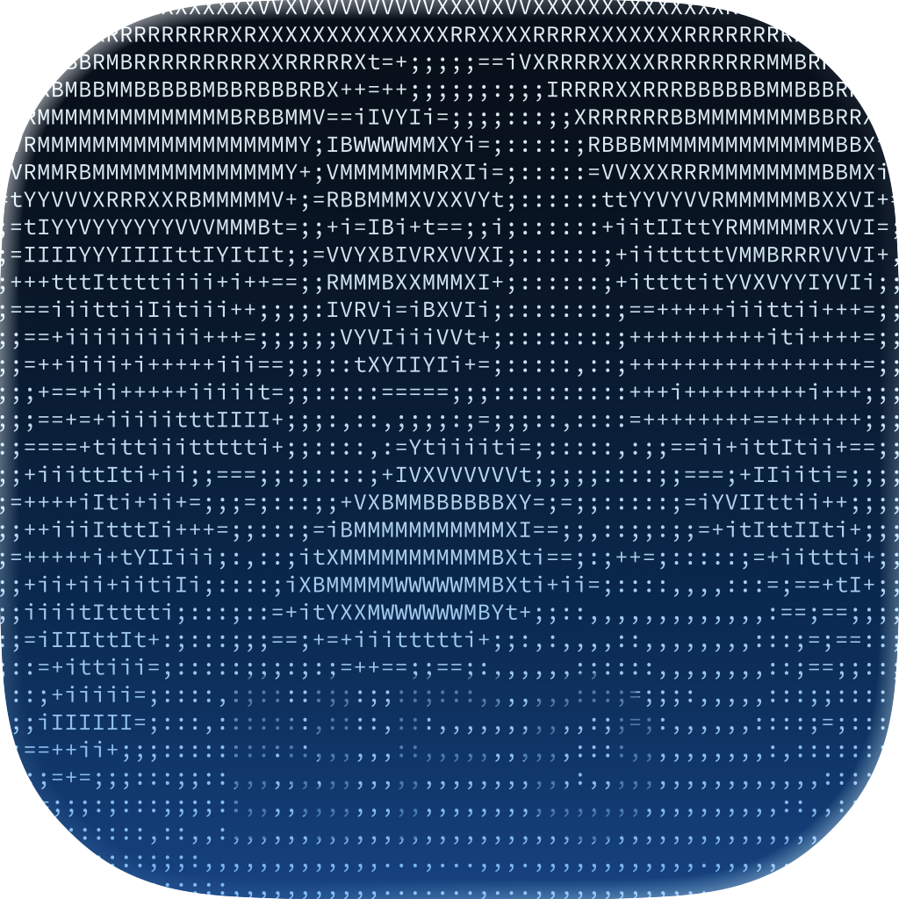
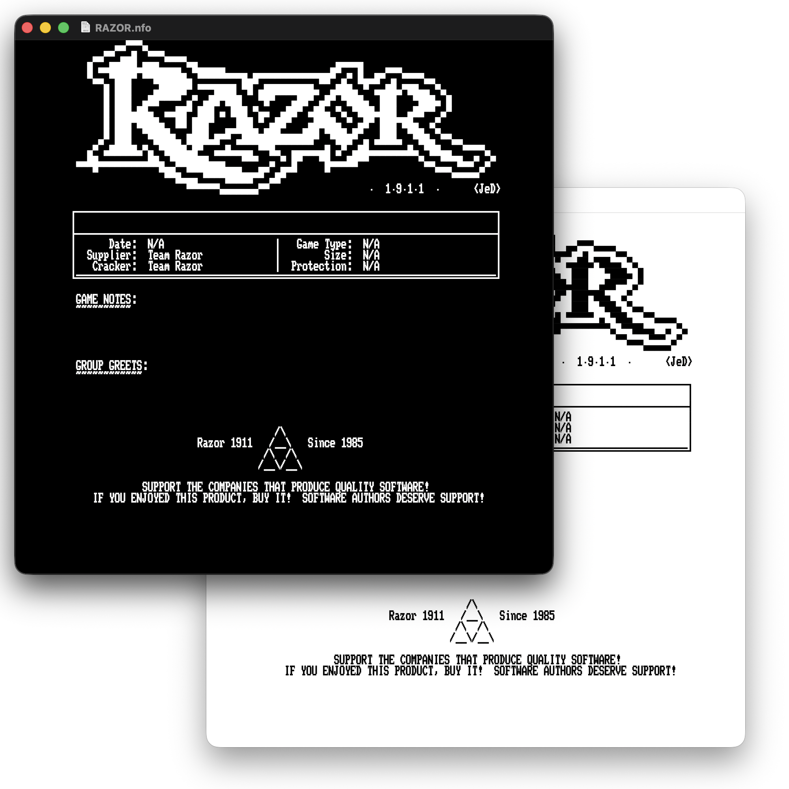
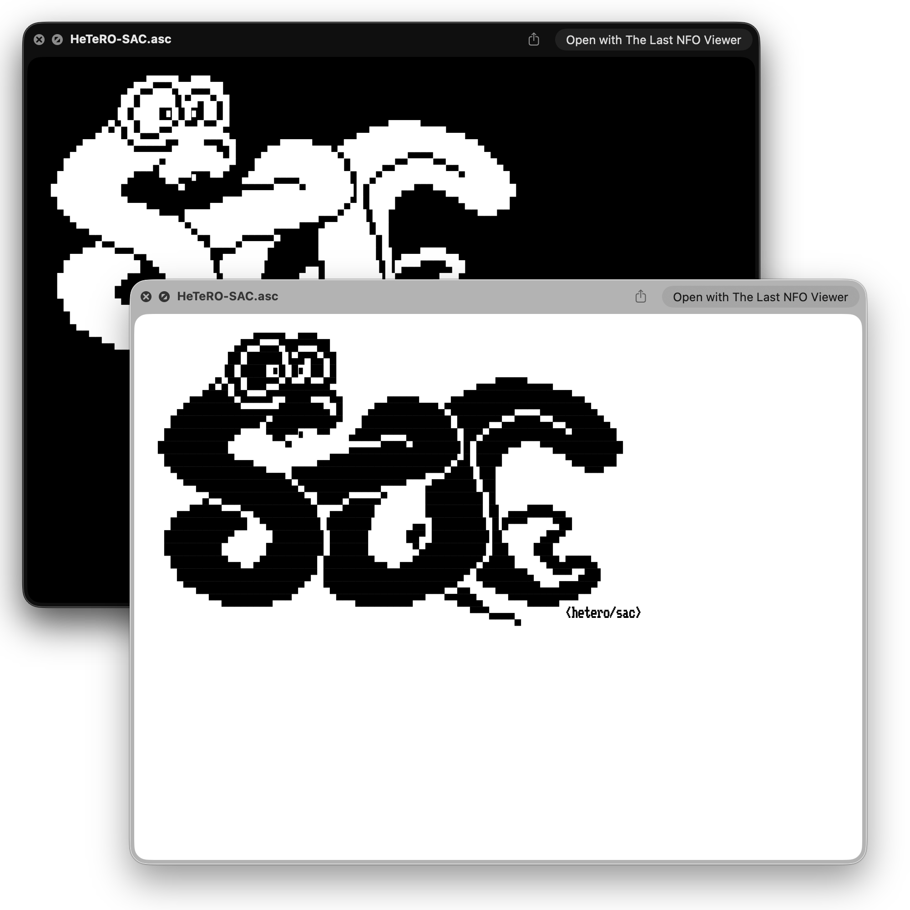

 

# The Last NFO Viewer

A modern, native macOS application for viewing NFO, ASC, and DIZ files, written in Swift.
This project has been inspired by [Yet Another NFO Viewer](https://github.com/mackonsti/yet-another-nfo-viewer)

## Features

- **Native macOS Experience**: Rewritten completely in Swift for modern macOS versions and Apple Silicon.
- **QuickLook Plugin**: Preview NFO files directly in Finder (Spacebar preview) without opening the app.
- **Hyperlinks**: Automatically detects and highlights URLs in NFO files.
- **Theme Support**: 
  - **Light/Dark Mode**: Fully supports system appearance or can be forced to specific modes.
  - **Custom Colors**: Customize text, background, link, and selection colors via Preferences.
- **Font Collection**: Bundled with high-quality DOS/ASCII fonts:
  - More Perfect DOS VGA (Default)
  - ProFontWindows
  - BlockZone
  - Fira Code Mono
  - JetBrains Mono
  - Extensive collection of Px437 (IBM CGA/EGA/VGA) fonts.

## Screenshots
 


### Configuration
The QuickLook plugin shares settings with the main application. When you change fonts or colors in the App's **Preferences**, the changes are saved to a shared configuration file (`~/.the-last-nfo-viewer.json`) which the QuickLook plugin reads.

## Installation

### From Source
Please refer to [BUILD.md](BUILD.md) for detailed build instructions.

Summary:
1.  Open `The Last NFO Viewer.xcodeproj` in Xcode.
2.  Build the **The Last NFO Viewer** scheme.
3.  Build the **NFO Preview** scheme (for QuickLook).

### Running the App
Since this app is self-signed (ad-hoc), macOS Gatekeeper might prevent it from opening.

1.  **Right-click** the app and select **Open**.
2.  Click **Open** in the confirmation dialog.

Alternatively, you can go to **System Settings > Privacy & Security** and click **Open Anyway** next to the message about the app being blocked.

If you move the app to `/Applications` and still face issues (e.g. "App is damaged"), remove the quarantine attribute:
```bash
xattr -cr /Applications/The\ Last\ NFO\ Viewer.app
```

## History
Original project "NFO Viewer" by [Kris Gybels](https://blockart.sourceforge.net/index.html)  
Then a rewrite to "Yet Another NFO Viewer" by [MacKonsti](https://github.com/mackonsti/yet-another-nfo-viewer)  
And now another complete rewrite, reaching its final form as `The Last NFO Viewer`.


## Troubleshooting
If the QuickLook preview doesn't appear or doesn't update after changing settings:

1.  **Reload QuickLook Cache**: Run the following command in Terminal:
    ```bash
    qlmanage -r
    ```
2.  **Verify Permissions**: The plugin is sandboxed. If it fails to read your settings, ensure you have run the main application at least once.


## License
See [LICENSE](LICENSE) file.


## Note
_Note that this is my first public app-project on GitHub. Be nice. :)_